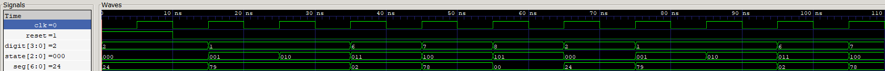

# FPGA Sequence FSM

A small digital design project built to revisit concepts from ECE 2277 including finite state machines, D flip-flops, sequential logic, and waveform simulation.

The circuit continuously cycles through the sequence:

```text
2 → 1 → 1 → 6 → 7 → 8 → repeat
```

The project was implemented in Verilog and simulated using Icarus Verilog and GTKWave.

---

## Project Overview

The design consists of three modules:

### sequence_fsm

Implements the finite state machine responsible for advancing through the sequence.

Responsibilities:

* State storage using D flip-flop style registers
* Next-state logic
* Digit generation

### seven_segment

Converts the generated digit into a 7-segment display pattern.

Responsibilities:

* Digit decoding
* Segment output generation

### top

Connects the FSM and display decoder together.

---

## Architecture

```text
                +----------------+
 clk ---------->|                |
 reset -------->|  sequence_fsm  |
                |                |
                +-------+--------+
                        |
                        | digit[3:0]
                        v
                +----------------+
                | seven_segment  |
                +-------+--------+
                        |
                        | seg[6:0]
                        v
                 7 Segment Display
```

---

## State Diagram

```text
S0 (2)
 |
 v
S1 (1)
 |
 v
S2 (1)
 |
 v
S3 (6)
 |
 v
S4 (7)
 |
 v
S5 (8)
 |
 +-------------> S0
```

---

## Simulation Result



The waveform confirms that the FSM advances correctly on each clock edge:

```text
2 → 1 → 1 → 6 → 7 → 8 → repeat
```

State transitions:

```text
000 → 001 → 010 → 011 → 100 → 101 → 000
```

---

## Tools Used

* Verilog HDL
* Icarus Verilog
* GTKWave
* Git
* GitHub

---

## Concepts Practiced

* Finite State Machines (FSMs)
* Sequential Logic
* D Flip-Flops
* Clocked Circuits
* State Registers
* Next-State Logic
* 7-Segment Display Decoding
* Hardware Simulation
* Waveform Analysis

---

## Running the Simulation

Compile:

```bash
iverilog -o sim/sequence_fsm_tb.vvp \
src/sequence_fsm.v \
src/seven_segment.v \
src/top.v \
sim/tb_sequence_fsm.v
```

Run:

```bash
vvp sim/sequence_fsm_tb.vvp
```

Open waveform:

```bash
gtkwave sim/sequence_fsm.vcd
```

---

## Repository Structure

```text
fpga-sequence-fsm/
│
├── docs/
│   └── waveform.png
│
├── sim/
│   └── tb_sequence_fsm.v
│
├── src/
│   ├── sequence_fsm.v
│   ├── seven_segment.v
│   └── top.v
│
├── .gitignore
└── README.md
```
